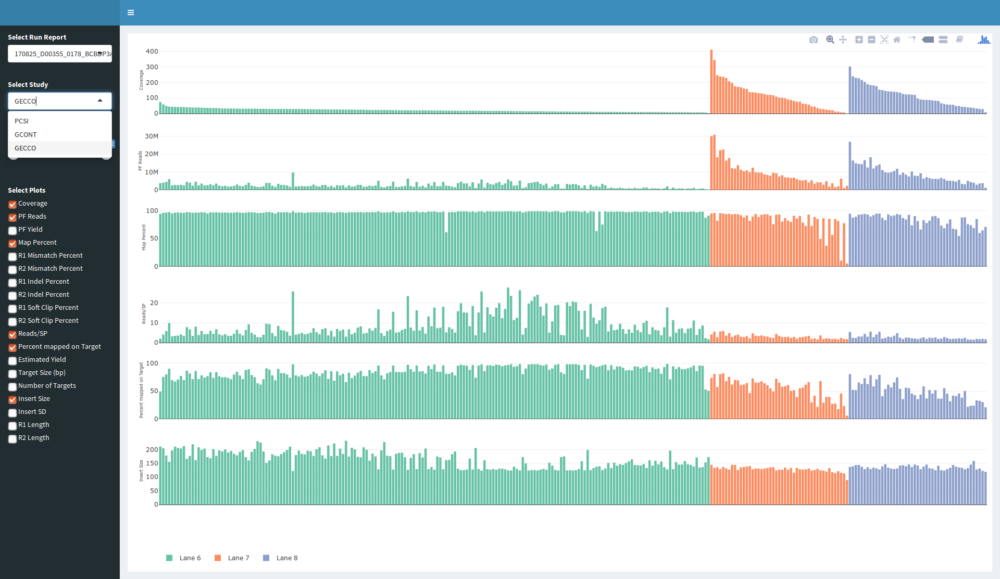

# Acquacotta
R Shiny App to display Run Reports generated by the OICR SeqWare pipeline.


## Deploying
Shiny requires [R 3.0+](https://www.r-project.org/).

Run command to install the required libraries
```bash
sudo su - -c "R -e \"install.packages(c('shiny', 'shinydashboard', 'data.table', 'plotly', 'stringr', 'yaml'), repos='http://cran.rstudio.com/')\""
```

Before starting Acquacotta, ensure Run Report TSV files are accessible in the directory specified in the [config file](config.yaml). Further options that can be modified are:
* Port on which Acquacotta is launched
* Default plots shown to user

### Rscript
Run the command below and open the listed address (default: http://127.0.0.1:11038) in a Web Broswer:
```bash
Rscript app.R
```

### RStudio
Load the [app.R file](app.R) in RStudio and click the [Run App button or press Command+Shift+Enter](https://shiny.rstudio.com/tutorial/written-tutorial/lesson1/).

### Shiny Server
See the [official documentation](http://docs.rstudio.com/shiny-server/#restarting-an-application) for detailed description on hosting Shiny Apps. To host Acquacotta, make repository visible in the server path (by default /srv/shiny-server and configurable at /etc/shiny-server/shiny-server.conf). 

## Updating
To ensure Shiny Server correctly hosts an updated version of Acquacotta, change the modification time of the [restart.txt file](restart.txt) immediately after an update. On Linux, that can be done by running
```bash
touch restart.txt
```

## Usage
* Use *Select Run Report* drop-down menu to select Run Report to load.
* Use *Select Study* to specify which study to plot.
* Use *Coverage* slider to exclude libraries that lie outside of range.
* Use *Select Plots* to specify which plots to render.


## Action points
- [x] config file for hardcoded variables (path to run reports)
- [x] ~~try-catch on the shinyApp function (to not bring down the server)~~ Shiny Server catches top level errors. They are displayed to the user and stack trace is logged.
- [x] good example (screen shot)
- [ ] write tests with an example TSV file (de-identified)
- [x] documentation! (this readme should have information how to start the server, through RStudio and links to docs for command line)
- [x] ~~add monitoring through Prometheus https://prometheus.io/docs/introduction/overview/~~ No clear way to do this now, as no R hooks exist
